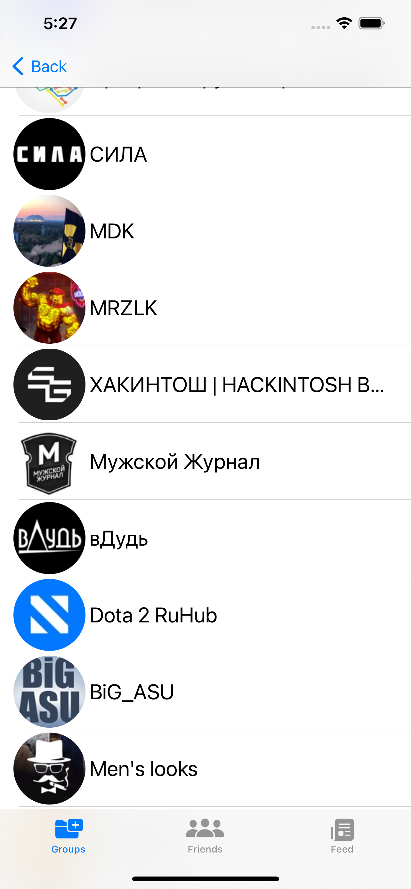
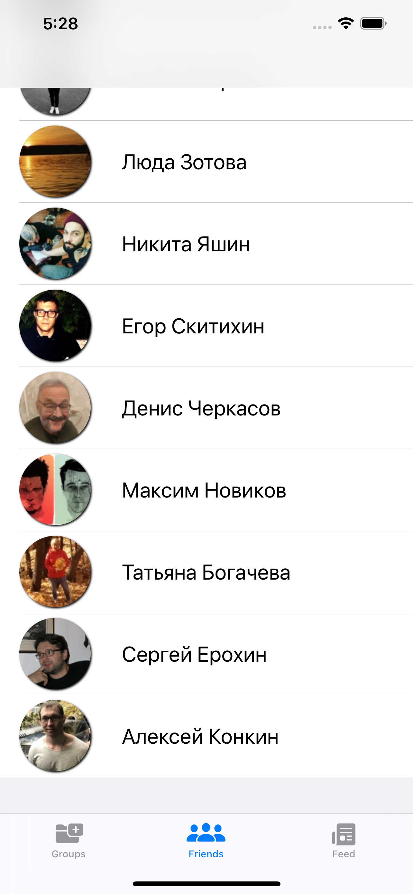
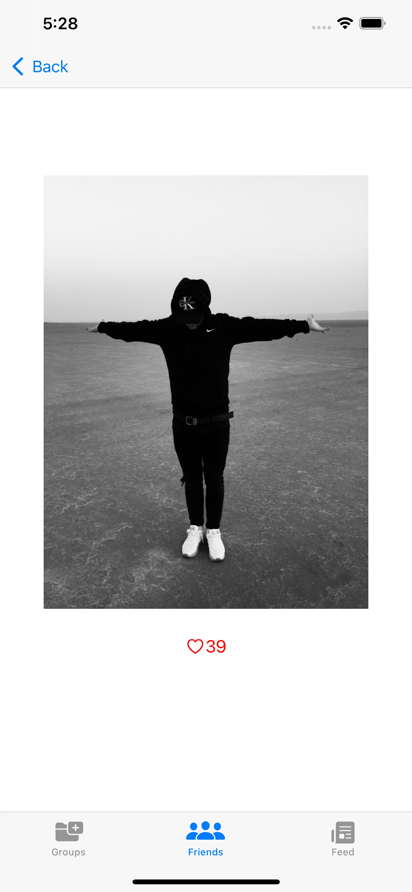

# VK client 
Client for social network VKontakte

## Интерфейс: 
- Storyboard; 
- AutoLayout;
- XIB; 
- верстка кодом.
## Разработка интерфейса UIKit: 
- TabBar; 
- TableView; 
- CollectionView; 
- NavigationView;
- Создание кастомных View.

## Работа с сетью и данными:
- Получение данных с помощью URLSession и Alamofire;
- Парсинг JSON;
- Применение Realm и знакомство с CoreData и FireBase.
- Работа с API соц. Сети ВКонтакте.

## Многопоточность и асинхронный код:
- NSOperation
- GCD

### Проект находится на ветке VKApp
### Примеры экранов:

       

     
